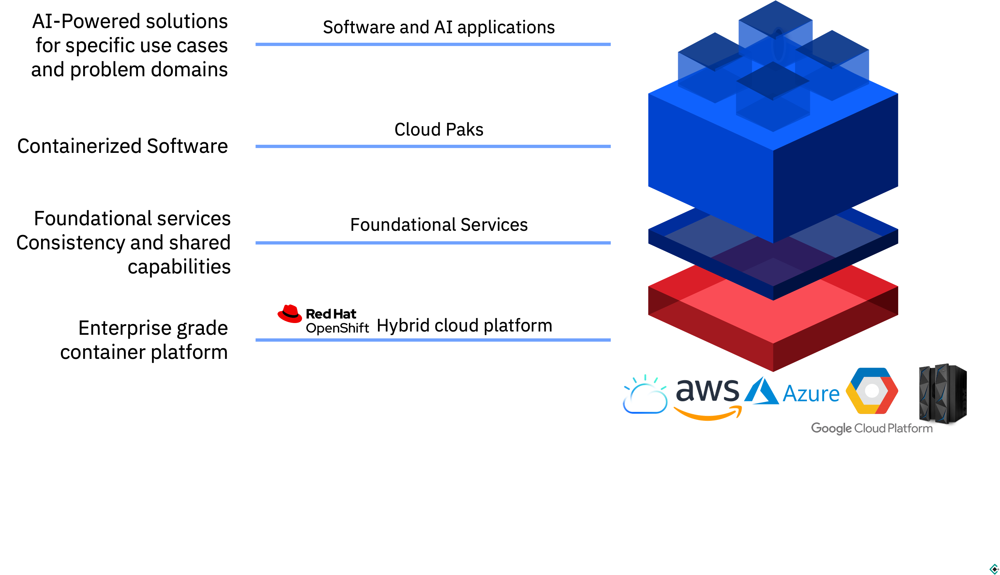
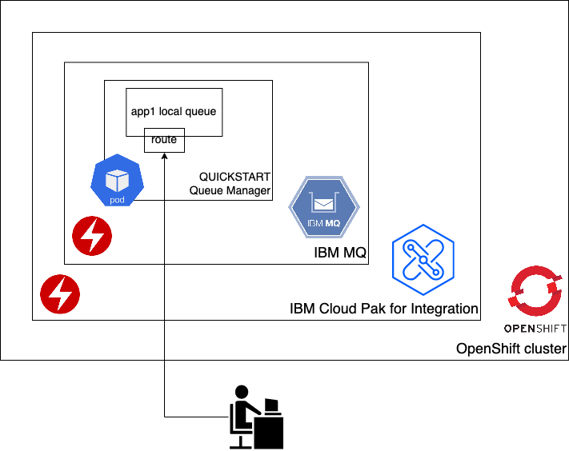
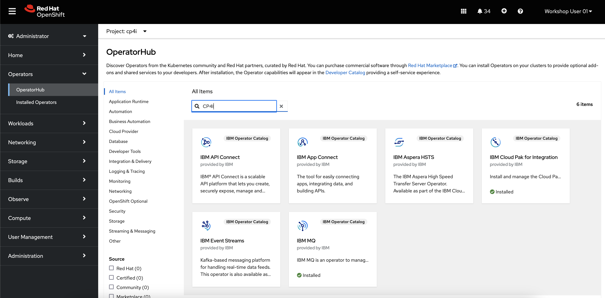
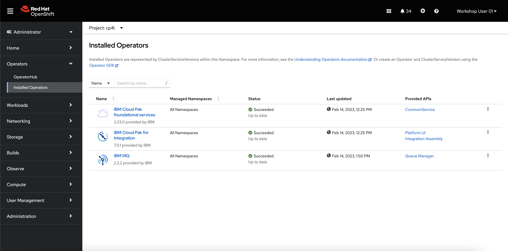
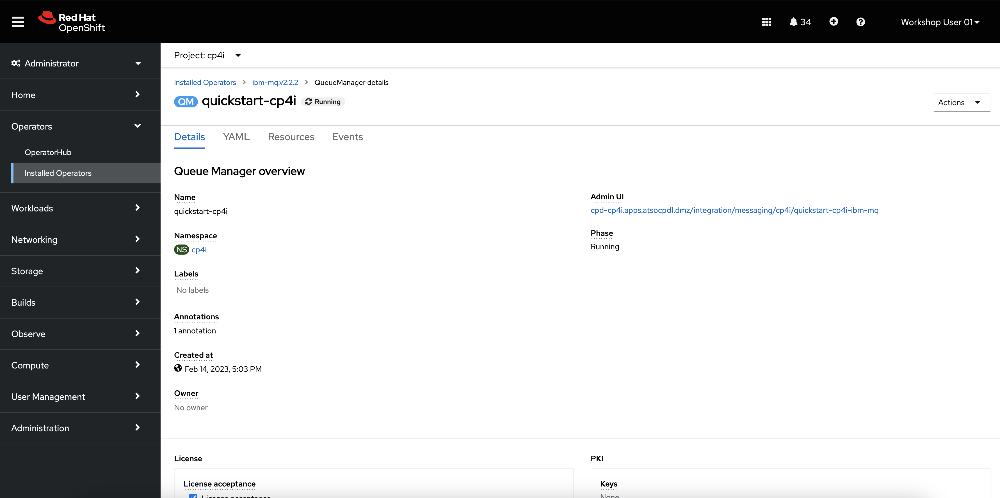
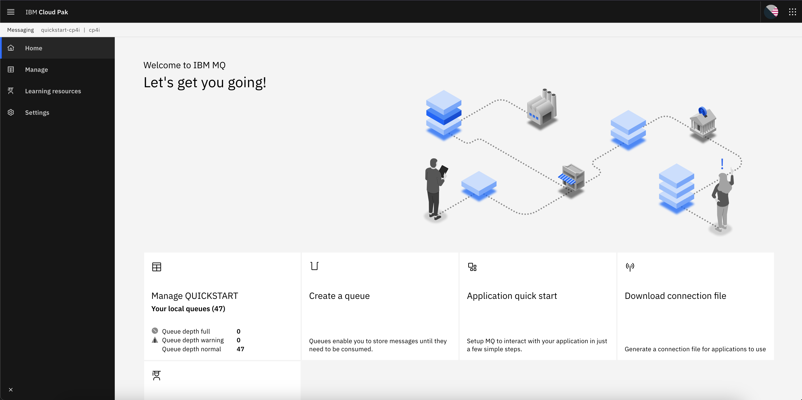
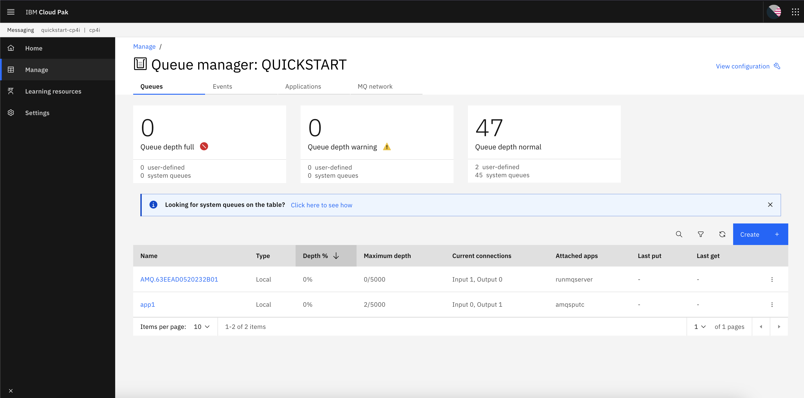
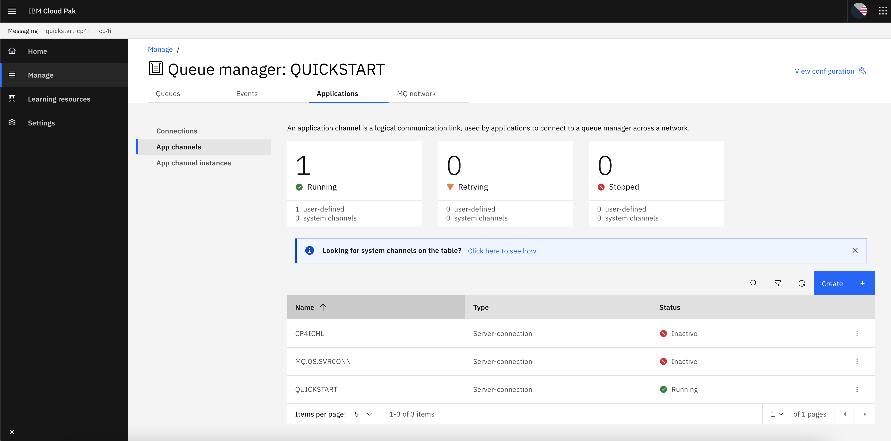
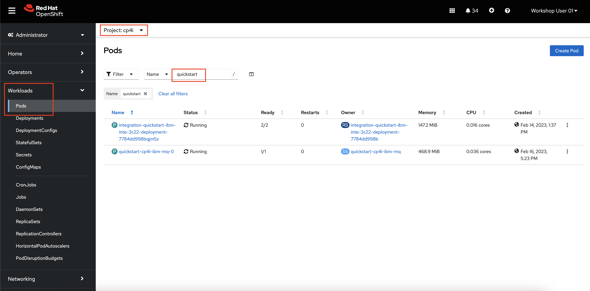
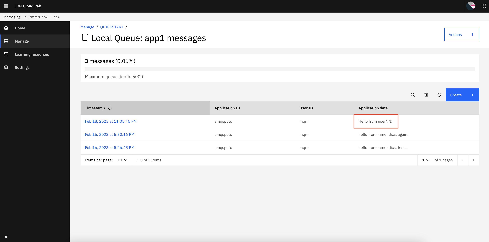

# cp4i-mq-intro
 
In this tutorial, you will walk through an introduction to Cloud Paks and how they run on top of OpenShift Container Platform. Those who are familiar with IBM MQ will see how running in Cloud Pak for Integration provides all of the benefits of a cloud platform without sacrificing any of the well established and trusted features of traditional IBM MQ deployments.

## Pre-requisites

1. Access to an OpenShift cluster
2. Basic knowledge of containers, Kubernetes, OpenShift, and how to navigate the OpenShift web console.
3. IBM Cloud Pak for Integration installed. This guide uses version `2022.4.1`.
4. IBM MQ Operator installed. This guide uses operator version `2.2.2`.
5. Users created with access to CP4I. This guide uses usernames `userNN` where `NN` is a two-digit number i.e. `01` or `15`.
6. Queue Manager created named `QUICKSTART` with local queue `app1` and app channel `QUICKSTART` with its Block user list set to `nobody`.

## IBM Cloud Paks Overview

[IBM Cloud Paks](https://www.ibm.com/cloud-paks) provide containerized versions of IBM software running on Red Hat OpenShift Container Platform (henceforth referred to as OpenShift or OCP). IBM Cloud Paks enable customers to fully adopt a hybrid cloud approach on any platform from public clouds like Amazon AWS, Microsoft Azure, and IBM Cloud, to on-premises platforms such as VMWare vSphere, IBM zSystems, and IBM Power.



All IBM Cloud Paks run on as [operators](https://www.redhat.com/en/technologies/cloud-computing/openshift/what-are-openshift-operators) on top of OpenShift which provides simple, consistent, and automated lifecycle management of the platforms and applications. With operators, installing and updating enterprise applications is as simple as filling out a form and clicking the install button.

All IBM Cloud Paks comes with a common layer of Foundational Services which provide operational services (licensing, metering), security services, (Identity and Access Management, Audit Logs, Certificate Management), a common user experience, and more. This layer of common services makes the management and use of IBM software simple and consistent. For more details about Foundational Services, refer to the documentation [here](https://www.ibm.com/docs/en/cloud-paks/1.0?topic=cloud-pak-foundational-services).

On top of OpenShift and Foundational Services is where the Cloud Paks begin to differentiate from one another. Each Cloud Pak is purpose-built for a specific use case, or set of use cases, and includes the appropriate IBM offerings. Below is a table of the available Cloud Paks as well as their use cases.

| Cloud Pak                             | Use Case                                                                                                                                                                           |
|---------------------------------------|------------------------------------------------------------------------------------------------------------------------------------------------------------------------------------|
| IBM Cloud Pak for Data                | Transactional and analytical databases, Data virtualization, governance, privacy, integration, AutoAI and Visual Data Science, Model risk management, fairness, and explainability |
| IBM Cloud Pak for Integration         | Application integration, API management, Messaging and events                                                                                                                      |
| IBM Cloud Pak for Watson AIOps        | Application impact avoidance, Hybrid application management, Observability                                                                                                         |
| IBM Cloud Pak for Business Automation | Workflow and decisions, Content services, Operational intelligence                                                                                                                 |
| IBM Cloud Pak for Security            | Threat intelligence, Federated search, Security information and event management, Data activity monitoring                                                                         |
| IBM Cloud Pak for Network Automation  | Intent-driven orchestration, Closed-loop operations, Network optimization                                                                                                          |

In this tutorial, you will be interacting with Cloud Pak for Integration (CP4I) - specifically with the *Messaging* use case of CP4I. Part of the messaging use case is delivered by IBM MQ.

IBM MQ is an enterprise messaging solution that supports the exchange of information between applications, systems, services and files by sending and receiving message data via messaging queues. This simplifies the creation and maintenance of business applications. IBM MQ works with a broad range of computing platforms and can be deployed across a range of different environments including on-premises, in cloud, and hybrid cloud deployments including Cloud Pak for Integration.

MQ can move massive amounts of data and messages between applications, systems, and services. It provides:
- **Data transfer across new cloud-based applications and core business systems** leveraging point-to-point and publish/subscribe models to fit application needs.
- **Once-and-only-once message delivery** to ensure your critical business data can be processed accurately and efficiently.
- **Robust message security** with protection for data at rest, in memory, and in-flight through fine grained authentication and powerful data encryption. 
- **Exceptional fault tolerance** with workload balancing, high availability, and disaster recovery capabilities ensures you never lose a message. 

## Environment Overview

The environment you will be interacting with already has the following components installed on an OpenShift cluster.
1. [Cloud Pak for Integration with the Platform Navigator](https://www.ibm.com/docs/en/cloud-paks/cp-integration/2022.4?topic=operators-installing-using-openshift-console) that provides the user interface
2. [IBM MQ operator](https://www.ibm.com/docs/en/ibm-mq/9.3?topic=dqmorhocpc-deploying-queue-manager-using-cloud-pak-integration-platform-ui-previously-platform-navigator) that comes with CP4I
3. An MQ queue manager named `QUICKSTART` with proper security, authorization, and storage configured
4. A local queue on the `QUICKSTART` queue manager named `app1`.



With IBM MQ running in CP4I, all of the components use Kubernetes-native resources. For example, the Cloud Pak and MQ solutions are deployed as operators, the queue manager is deployed in a pod, and access to the local queue is provided through a Kubernetes route that exposes the service associated with the pod. As with any other workload, Kubernetes ensures that the queue manager pod is available and ready with the help of liveliness probes, a statefulset, and various other Kubernetes objects that those from the cloud-native world will recognize.

As you will hopefully see throughout this tutorial, IBM Cloud Paks take enterprises software solutions that are mission critical to many of the largest companies in the world and delivers them with a modern, cloud-native approach.

## Exploring the Operators

Cloud Paks and the individual solutions they contain (IBM MQ for example) are deployed as operators on an OpenShift cluster. With operators, you do not need to create individual Kubernetes objects (such as Pods, services, or secrets) or do any manual work to integrate them with one another to function as one coherent application. Furthermore, when the time comes to update your application to a new release, the operator takes care of all of that for you. For certified operators like those coming from IBM or Red Hat, the new version of the software and the upgrade process has been tested and validated, so you can be confident that the upgrade will go smoothly. 

1. **Open a web browser such as Firefox or Google Chrome.**

2. In the browser, **navigate to your OpenShift console.** 

    The OpenShift console typically begins with `https://console-openshift-console-`. Reach out to your OpenShift administrator if you do not have this address.

    You will now see the OpenShift console login page.

    

3. **Log in with your OpenShift credentials.**

    Reach out to your OpenShift administrator if you do not have these credentials.

4. **Under the administrator perspective, navigate to Operators -> OperatorHub. In the search box, enter `CP4I`.**

    

    The IBM Cloud Pak for Integration and IBM MQ operators have already been installed. This is an administrator task that must only be performed one time per OpenShift cluster. These are both `cluster-wide` operators, meaning that once installed, CP4I or MQ resources can be deployed into any project in the cluster. With proper credentials and sufficient cluster resources (CPU, memory, disk), multiple instances of CP4I an MQ can be deployed for different users, teams or applications.

    By installing the Operators from OperatorHub, new **CustomResourceDefinitions** have been added to the cluster. CustomResourceDefinitions (CRDs) are custom Kubernetes resources that extend the Kubernetes API so you can deploy objects that are not standard Kubernetes resource types (such as deployments or pods). For example, installing the IBM MQ operator creates a CRD named `QueueManager`, which is exactly what it sounds like - a template to build MQ Queue Managers in OpenShift. 

    With CustomResourceDefinitions defined in the OCP cluster, you then can use them by creating a **CustomResource (CR)** - an instance of the CRD. With the MQ example in this lab, there is an instance deployed named `quickstart-cp4i`, which is a CRD built from the QueueManager CRD. The difference seems pedantic, but it is non-trivial. The difference between a CRD vs. a CR is similar to that of a Container Image vs. a Container.

5. **Navigate to Operators -> Installed Operators, and navigate to the `CP4I` project.**

    

    You will notice that in the CP4I project, there are operators installed for the IBM Cloud Pak Foundational Services, IBM Cloud Pak for Integration, and IBM MQ. Remember that these are all cluster-wide resources that are accessible to every project in the cluster, so you can also see and use them in any other project.

    On this screen you can also see the `Provided APIs`, or CRDs, that were installed by the operator. For example, the QueueManager for the IBM MQ operator.

6. **Click the link for the IBM MQ operator.**

    On this page, you see details about the operator, how to use it, its requirements, and more. This is essentially the operator's README file.

7. **Click the Queue Manager tab.**

    Now you see the list of Queue Manager CRs. In this tutorial cluster, there is only the single QueueManager installed, named `quickstart-cp4i`.

8. **Click the link for the `quickstart-cp4i` QueueManager.**

    Now you see information specific to the Queue Manager we will be using in this lab. Scrolling down this page, you will find options to adjust TLS, storage, resource constraint, and observability settings. You cannot edit these values as a read-only member of the `CP4I` project, but an administrator or developer with proper credentials could do so.

    

9. **Click the link for the Admin UI, change the login provider to OpenShift authentication, and log in with the same credentials you used to log into OpenShift.**

    

    This is the homepage for the IBM MQ console. From here, you can manage Queue Managers, queues, and generate connection files that can be used to integrate applications with the CP4I queues.

10. **Click the tile for `Manage QUICKSTART`.**

    

    Those who are familiar with MQ will start to recognize the remainder of this tutorial, which should not surprising because it is the same software packaged up as Kubernetes resources running on OpenShift.

    On the Queues tab, you should see a queue named `app1`. This is a local queue that we will be putting a message on later. 

11. **Click the Applications tab -> App channels**.

    

    The Application channel also called `QUICKSTART` should be running. This is the MQ channel we will use to put a message onto the local queue.

12. **Explore the Queue Manager further by navigating around the MQ console**. You are able to view the configuration and security settings, build a sample application that connects to the queue, or generate connection files that can be used in your own applications.

13. When you're ready to move on, **keep the MQ console open, but open a second browser tab and navigate to the OpenShift console.**

14. In OpenShift, **navigate to Workloads -> Pods and check that you're in the `CP4I` project. Search for `quickstart` in the filter bar.**

    

15. **Click the link for the `quickstart-cp4i-ibm-mq-0` pod.**

    Here you can look at the details for the Kubernetes pod where the QUICKSTART queue manager is running. If there were multiple queue managers deployed in this CP4I instance, they would be deployed as separate pods.

16. **Look through the pod details, metrics, YAML, logs, and events as you wish.**

17. **Select the Terminal tab.**

    You're now connected to the pod's shell where you can interact with containerized applications like you would if it were in any other environment. The pod shell is accessible both in the web terminal as you see right now and through the command line with the `oc rsh` command.

18. In the pod terminal, **run the following command to display the MQ version.**

    ```text
    dspmqver
    ```

    Sample output:

    ```text
    sh-4.4$ dspmqver
    Name:        IBM MQ
    Version:     9.3.1.1
    Level:       p931-001-230110
    BuildType:   IKAP - (Production)
    Platform:    IBM MQ for Linux (zSeries 64-bit platform)
    Mode:        64-bit
    O/S:         Linux 4.18.0-372.40.1.el8_6.s390x
    O/S Details: Red Hat Enterprise Linux 8.7 (Ootpa)
    InstName:    Installation1
    InstDesc:    IBM MQ V9.3.1.1 (Unzipped)
    Primary:     N/A
    InstPath:    /opt/mqm
    DataPath:    /mnt/mqm/data
    MaxCmdLevel: 931
    LicenseType: Production
    ```

19. **Look at the running queues via the terminal.**

    ```text
    dspmq
    ```

    Sample output:
    ```text
    sh-4.4$ dspmq
    QMNAME(QUICKSTART)                                        STATUS(Running)
    ```

    All of the information you see in the terminal directly reflects that which you see in the CP4I user interface.

    Next you'll put a test message onto the `app1` queue.

20. **Set the `MQSERVER` variable which will be used in the following command.**

    ```text
    export MQSERVER='QUICKSTART/TCP/quickstart-cp4i-ibm-mq(1414)'
    ```

21. **Use the `amqsputc` application to put a message onto the `app1` queue via the `QUICKSTART` channel.**

    ```text
    /opt/mqm/samp/bin/amqsputc app1 QUICKSTART
    ```

    You will now have a prompt waiting for you to enter a message.

22. **Type out a message to put on the queue, such as `Hello from userNN`, where `NN` is your user number.**

    Sample output:
    ```text
    sh-4.4$ /opt/mqm/samp/bin/amqsputc app1 QUICKSTART
    Sample AMQSPUT0 start
    target queue is app1
    Hello from userNN!
    ```

23. **Break out of the prompt with `ctrl+c`**.

24. **Navigate to the `app1` local queue in the Cloud Pak for Integration console**.

    

    With your test message successfully put on the test queue and visible from the Cloud Pak for Integration console, a next step could be to connect this queue to an external business application or remote queue manager. For some examples of how this can be done with various programming languages, see the GitHub repo [here](https://github.com/ibm-messaging/mq-dev-patterns).

## Resources
- [IBM Cloud Paks Product Page](https://www.ibm.com/cloud-paks)
- [IBM Cloud Pak for Integration Product Page](https://www.ibm.com/products/cloud-pak-for-integration)
- [IBM Cloud Pak for Integration Documentation](https://www.ibm.com/docs/en/cloud-paks/cp-integration/2022.4)